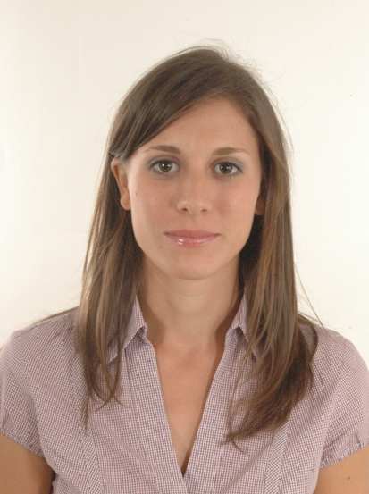

```{r pressure, echo=FALSE, fig.cap="", out.width = '25%', fig.align="center"}

```

<center>
[<i class="fa fa-envelope-o"></i>](mailto:valentina.noacco@bristol.ac.uk) \ \ \ \ [<i class="fa fa-institution"></i>](http://www.bristol.ac.uk/engineering/people/valentina-noacco/overview.html) \ \ \ [<i class="fa fa-graduation-cap"></i>](https://scholar.google.co.uk/citations?user=6RfiljEAAAAJ&hl=en) \ \ \ [<i class="fa fa-twitter"></i>](https://twitter.com/valentinanoacco)
</center>
