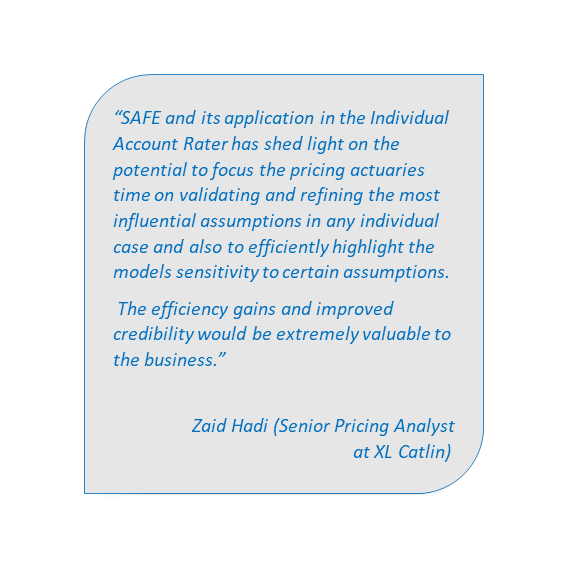
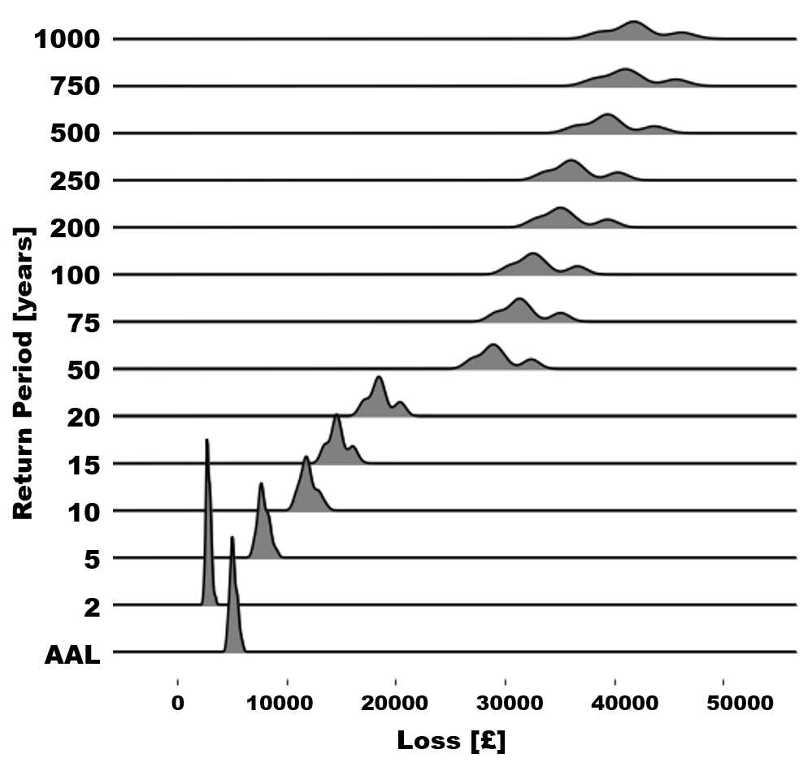
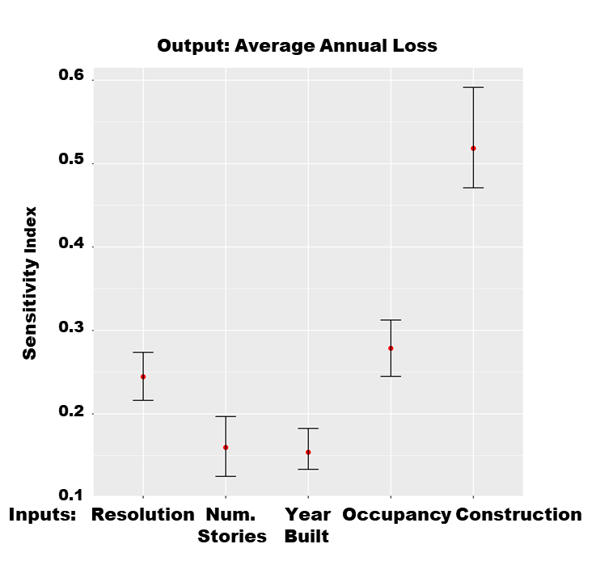

  \ \ \ \ \ \ \ \ \  

 

## Background Information about the Project 

Insurance companies provide insurance against a wide range of threats, such as natural hazards. Losses from natural disasters are increasing globally (in 2017 they were estimated to be USD 340 billion) [1](#munichre_ref). To monitor risk and support investment decisions, insurance companies use mathematical models to predict losses from these threats (natural or man-made), to help calculate fair and robust risk premiums, and to ensure appropriate capital allocation, such that there is little risk of the company finding itself in financial trouble should deleterious events occur. To accurately quantify risk and achieve a robust decision-making process, uncertainties in the mathematical models that underpin decisions need to be efficiently captured. The complexity of the models used, together with their often proprietary nature, makes a comprehensive, transparent and easily communicable quantification of the uncertainties very difficult. Moreover, in Europe the re-insurance sector is required by the Solvency II Directive [2](#solvencyII) to test the models used in a way that uncertainties are adequately captured, to assess the risks faced and to have plans in place to mitigate them. Nonetheless, there is a lack of standardised regulatory guidelines for model validation. The use of Sensitivity Analysis to test mathematical models in a structured way facilitates the re-insurance sector to meet regulatory requirements and helps to form a view of risk which takes into account the uncertainties and assumptions in the models.

  

## Summary of what has been achieved

We developed several case studies with re-insurance companies and model vendors, which demonstrate the benefit of using Global Sensitivity Analysis (GSA) to help the catastrophe model building process and forming their view of risk. 

In the specific, a [case study](https://safe-insurance.uk/Outputs.html#selected_presentations) with the **actuarial pricing team at AXA XL** shows how increased efficiency of their model validation process can be reached, by highlighting the most influential assumptions that deserve extra attention when reviewing the model. The case study also allows to better communicate the underlying model uncertainty to underwriters and to enhance the credibility of the results. 

We also developed a [case study](https://safe-insurance.uk/Outputs.html#briefings) with **JBA Risk Management** on their Global Flood Model. By varying model inputs that are not normally varied in traditional cat models, we achieved an increased understanding of the model beyond its default set up. Moreover, the uncertainty of the losses at different return periods in the Exceedance-Probability curve is visualised, an insight not usually available for model users, but which allows to adequately communicate uncertainties to decision-makers. 

 

_Distribution of losses by return period (RP) shows increased uncertainty with higher RP (JBA case study)._
 

 

Finally, the [case study](https://safe-insurance.uk/Outputs.html#briefings) with **AXA XL on a third-party cat model** empowers model users to explore the model uncertainties on which they have control of, as proprietary models have limited components that can be modified. In turn, by exploring the impact of exposure data and the spatial resolution on the model losses we could prioritise the investments on better quality data that would reduce the losses uncertainty the most.

 

_Construction type is the most influential input factor among the primary modifiers investigated (AXA XL case study)_
 

 

The knowledge gained through these case studies has been disseminated to the wider re/insurance sector through [presentations and workshops](https://safe-insurance.uk/Outputs.html#selected_presentations) at conferences, both academic, and industry-specific and with [tutorials](https://safe-insurance.uk/Outputs.html#training_material) at four major re/insurance companies.

  

  

## Project Teams

### Academic collaborators:
- [Francesca Pianosi](http://www.bris.ac.uk/engineering/people/francesca-pianosi/index.html)
- [Thorsten Wagener](http://www.bristol.ac.uk/engineering/people/thorsten-wagener/)

### Industry partners:
- [AXA XL](https://axaxl.com/)
- [OASIS Loss Modelling Framework](https://oasislmf.org/)

### Case study partners:
- [JBA Risk Management](https://www.jbarisk.com/)

 

 \ \ \ \ \ \ \ \ \     \ \ \ \ \ \ \ \ \  

  
  
  

[1] - [Munich Re (2018)](https://www.munichre.com/topics-online/en/2018/01/2017-year-in-figures)

 

[1] - [EC (2009) Directive 2009/138/EC The taking-up and pursuit of the business of Insurance and Reinsurance (Solvency II)](https://eur-lex.europa.eu/legal-content/EN/ALL/?uri=celex%3A32009L0138)

