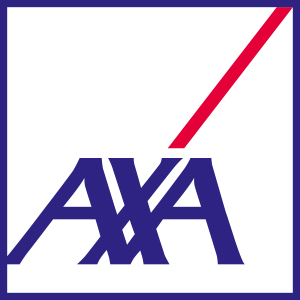
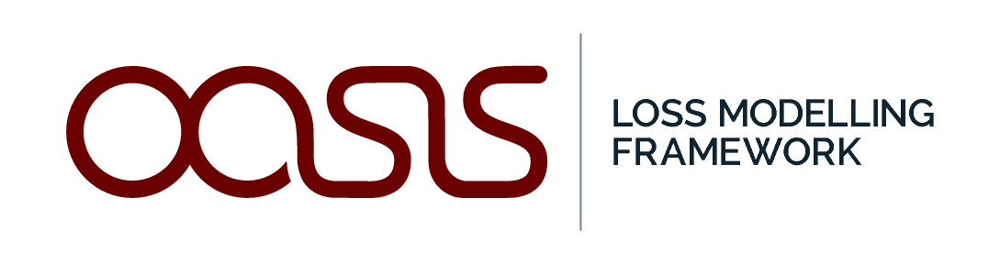
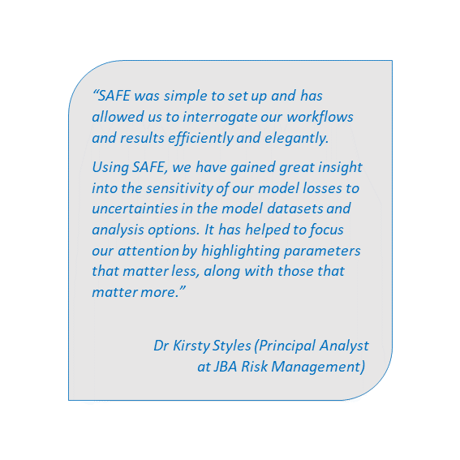

<br> 

## Background Information on the Project 

Insurance companies provide insurance against a wide range of threats, such as natural hazards. Losses from natural disasters are increasing globally (in 2017 they were estimated to be USD 340 billion) [1]. To monitor risk and support investment decisions, insurance companies often use numerical models to predict losses from various threats (natural or man-made), to help calculate fair and robust risk premiums, and to ensure appropriate capital allocation, such that there is little risk of the company finding itself in financial trouble should deleterious events occur. While these models are essential tools to create your own view of risk, their licenses, training and validation is costly. Moreover, in Europe the insurance sector is required by the  Solvency II Directive [2] to test the models used in a way that uncertainties are adequately captured, to assess the risks faced and to have plans in place to mitigate them. Nonetheless, there is a lack of standardised regulatory guidelines for model validation. The use of Sensitivity Analysis to test numerical models in a structured way will facilitate the (re)insurance sector to meet regulatory requirements and will help to form a view of risk which takes into account the uncertainties and assumptions in the models.

<br> 

## Project Summary

The project aims to transfer methods (i.e. Global Sensitivity Analysis (GSA)) and tools (i.e. the SAFE (Sensitivity Analysis For Everybody) software toolbox developed by Bristol University and funded by NERC) to the (re)insurance industry, and to tailor them in such a way to facilitate their uptake in the (re)insurance industry. These tools will improve the ability of the (re)insurance sector to understand the impact of models' underlying assumptions, to capture the risks and uncertainties embedded in their models, and provide more structured approaches to validate their models. An increased understanding and consideration of uncertainty in the insurance modelling process will promote a more continuous and aware use of model predictions to support financial decision-making. In turn, an adequate quantification of risks and vulnerability due to possible models flaws will lead to better-informed and more robust business decisions. Ultimately this will increase the transparency of an insurer’s risk profile, contribute to reduce and manage financial risk, reduce capital requirements and stabilise earning. Therefore this will strengthen the leading position of the UK in the area.

<br> 

## Summary of Project Activities

In the first stage of my fellowship project, I build on the existing collaboration with the (re)insurance company AXA XL (former XL Catlin) to review how numerical models are developed, validated and used within their company. I will develop case study applications, detailed workflows and a tailored version of the SAFE toolbox for (re)insurance (in the R language) which will form the basis to transfer expertise on the use of GSA methods in the (re)insurance sector. 

This material will be the building block for disseminating best practices across the wider (re)insurance industry. This will be achieved both by collaborating with the OASIS LMF consortium - including a tailored version of SAFE in their open access platform as the standard methodology for rigorous model validation - and by holding workshops for the wider (re)insurance industry. 

<br> 

## Project Teams

### Academic collaborators:
- [Francesca Pianosi](http://www.bris.ac.uk/engineering/people/francesca-pianosi/index.html)
- [Thorsten Wagener](http://www.bristol.ac.uk/engineering/people/thorsten-wagener/)

### Industry partners:
- [AXA XL](https://axaxl.com/)
- [OASIS Loss Modelling Framework](https://oasislmf.org/)

### Case study partners:
- [JBA Risk Management](https://www.jbarisk.com/)

<br>

 \ \ \ \ \ \ \ \ \     \ \ \ \ \ \ \ \ \  


```{r quote, echo=FALSE, fig.cap="", out.width = '40%', fig.align="right"}

```

<br> 
<br> 
<br> 
[1] - [Munich Re (2018)](https://www.munichre.com/topics-online/en/2018/01/2017-year-in-figures)

[2] - [EC (2009) Directive 2009/138/EC The taking-up and pursuit of the business of Insurance and Reinsurance (Solvency II)](https://eur-lex.europa.eu/legal-content/EN/ALL/?uri=celex%3A32009L0138)

